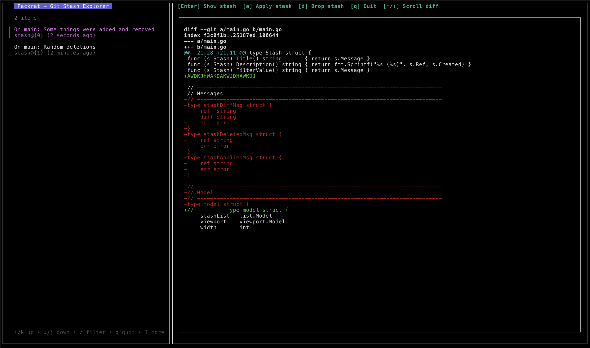

# Packrat

## A simple Git ~~trash~~ stash explorer

I use my stash a lot, and I like using it, but it can be hard to go back through and clean up old items and keep a sense of cleanliness when I can't just delete everything and start fresh all that often.

This is a simple tool built in Go, a language I am working on becoming more comfortable with.

### Installation

1. Clone the repo
1. run `go build`
1. run `go install`

**Note**: You may need to add your Go bin directory to your $PATH. You can do this by running the following command:

```
go list -f '{{.Target}}'
```

And then removing "packrat" from the end, and using that path to update your .bashrc/.zshrc/etc with a line that looks like this:

```
export PATH=$PATH:/path/to/your/bin/directory
```

### Screenshot

